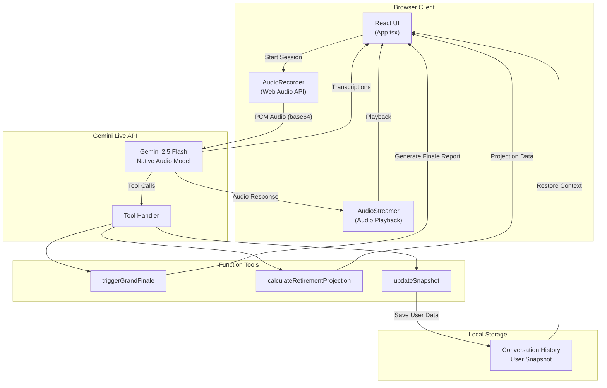
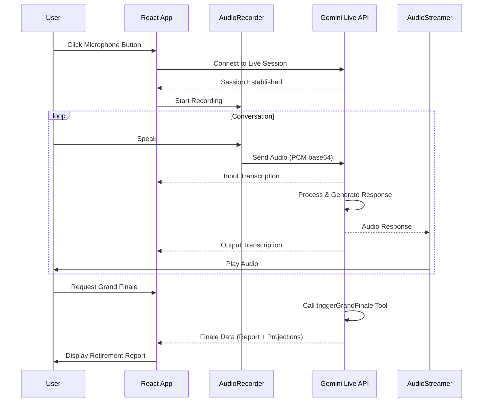

<div align="center">

</div>

# Akira - Retirement Planning Voice Assistant

An app built with and uses Gemini and Google AI Studio proudly.

Akira is an AI-powered voice assistant that helps users plan their retirement through natural conversation. It uses Gemini's live audio streaming capabilities to provide real-time, personalized financial guidance.

## Architecture



## Data Flow



## Features

- **Real-time Voice Conversation**: Natural dialogue powered by Gemini's native audio streaming
- **Retirement Planning Tools**: Projection calculations, snapshot tracking, and comprehensive finale reports
- **Persistent Context**: Conversation history and user data saved locally for continuity
- **Mobile-Friendly**: AudioContext handling optimized for mobile browsers

## Run Locally

**Prerequisites:** Node.js

1. Install dependencies:
   ```bash
   npm install
   ```

2. Set the `VITE_GEMINI_API_KEY` in `.env.local` to your Gemini API key:
   ```bash
   VITE_GEMINI_API_KEY=your_api_key_here
   ```

3. Run the app:
   ```bash
   npm run dev
   ```

## Tech Stack

- **Frontend**: React 19, Vite, TailwindCSS, Motion (Framer Motion)
- **AI**: Google Gemini 2.5 Flash Native Audio Preview
- **Audio**: Web Audio API (AudioContext, MediaStream)
- **Charts**: Recharts
- **Deployment**: Vercel

## Environment Variables

| Variable | Description |
|----------|-------------|
| `VITE_GEMINI_API_KEY` | Your Google Gemini API key |

## License

MIT
