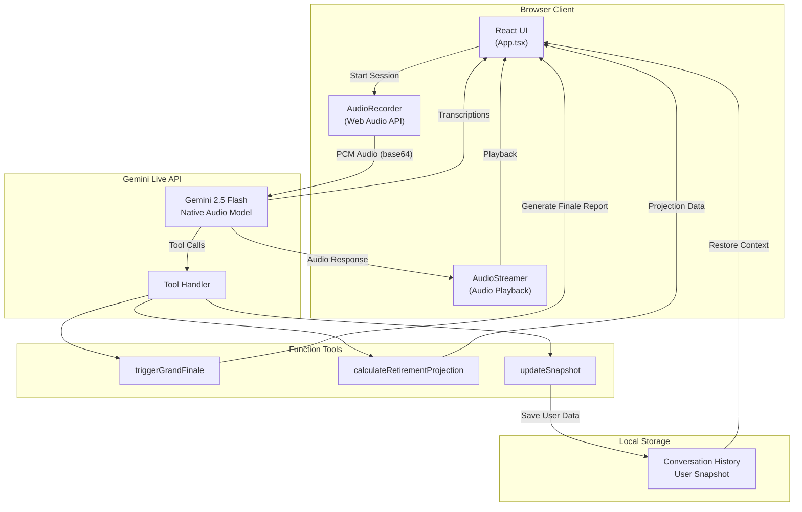
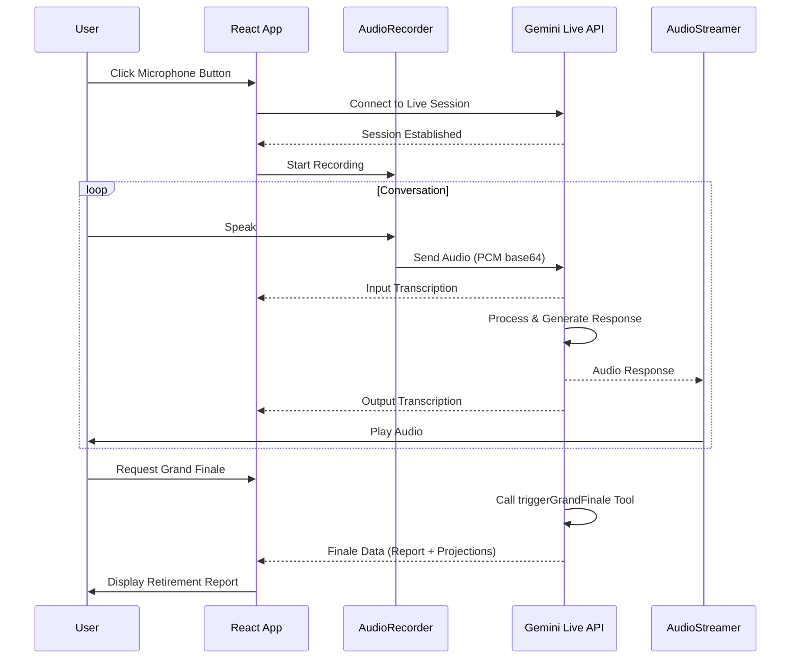

<div align="center">

</div>

# Akira - Retirement Planning Voice Assistant

An app built with and uses Gemini and Google AI Studio proudly.

Akira is an AI-powered voice assistant that helps users plan their retirement through natural conversation. It uses Gemini's live audio streaming capabilities to provide real-time, personalized financial guidance.

## Architecture



## Data Flow



## Features

- **Real-time Voice Conversation**: Natural dialogue powered by Gemini's native audio streaming
- **Retirement Planning Tools**: Projection calculations, snapshot tracking, and comprehensive finale reports
- **Persistent Context**: Conversation history and user data saved locally for continuity
- **Mobile-Friendly**: AudioContext handling optimized for mobile browsers
- **Google Authentication**: Sign in with Google to save your retirement planning data across devices

## Run Locally

**Prerequisites:** Node.js 18+, a microphone, and a Gemini API key

1. Clone the repository:
   ```bash
   git clone https://github.com/adihere/akira-retirement-planner-voice-.git
   cd akira-retirement-planner-voice-
   ```

2. Install dependencies:
   ```bash
   npm install
   ```

3. Create a `.env.local` file and add your Gemini API key:
     ```bash
     cp .env.example .env.local
     # Edit .env.local and set your API key
     GEMINI_API_KEY=your_api_key_here
     ```

4. Set up Firebase for Google Authentication:
    ```bash
    npm install firebase
    ```
   
   - Create a Firebase project at [https://console.firebase.google.com/](https://console.firebase.google.com/)
   - Enable **Google Authentication** in the Firebase console (Authentication > Sign-in method > Google)
   - Add the Firebase environment variables to your `.env.local` file (see format in `.env.example`):
     ```bash
     FIREBASE_API_KEY=your_firebase_api_key
     FIREBASE_AUTH_DOMAIN=your_project_id.firebaseapp.com
     FIREBASE_PROJECT_ID=your_project_id
     FIREBASE_APP_ID=your_firebase_app_id
     ```

5. Run the app:
   ```bash
   npm run dev
   ```

5. Open [http://localhost:3000](http://localhost:3000) in your browser

## Testing the Application

### Quick Start Test

1. **Allow microphone access** when prompted by the browser
2. **Click the microphone button** to start a session with Akira
3. **Speak naturally** - try saying: "Hi Akira, I'm 45 years old and want to retire at 60"
4. **Listen to Akira's response** and continue the conversation
5. **Request your finale report** by saying: "Can you give me my retirement summary?"

### Test Scenarios

| Scenario | What to Say | Expected Result |
|----------|-------------|-----------------|
| **Basic Introduction** | "Hi, I'm new to retirement planning" | Akira introduces herself and asks about your goals |
| **Financial Input** | "I have a pension worth 200,000 pounds and earn 50,000 a year" | Akira acknowledges and may call `updateSnapshot` to save your data |
| **Projection Request** | "What will my retirement look like?" | Akira calculates projections using `calculateRetirementProjection` |
| **Grand Finale** | "Give me my complete retirement report" | Akira triggers `triggerGrandFinale` with full visual report |
| **Context Continuity** | Refresh the page and start a new session | Akira remembers your previous conversation context |

### Troubleshooting

| Issue | Solution |
|-------|----------|
| No audio playback | Check browser audio permissions and volume |
| Microphone not working | Ensure microphone permissions are granted; try a different browser |
| "API key not configured" error | Verify `GEMINI_API_KEY` is set in `.env.local` |
| Session won't connect | Check your internet connection and API key validity |
| Mobile audio issues | Tap the screen once before starting (helps with AudioContext activation) |

### Browser Compatibility

| Browser | Status | Notes |
|---------|--------|-------|
| Chrome 90+ | Fully Supported | Recommended |
| Firefox 90+ | Fully Supported | - |
| Safari 15+ | Supported | May require user interaction for audio |
| Edge 90+ | Fully Supported | - |
| Mobile Chrome | Supported | Tap screen before starting session |
| Mobile Safari | Supported | Tap screen before starting session |

## Authentication

Akira now supports Google login with 3 free conversations before sign-in is required.

### How the Trial Works

- **Anonymous Access**: New users can explore Akira with up to 3 conversations without signing in
- **Conversation Counting**: Each voice session counts as one conversation
- **Trial Limit**: After 3 conversations, users must sign in with Google to continue using the app
- **Data Persistence**: Signed-in users can access their retirement planning data across different devices

### Sign In with Google

1. Click the **"Sign in with Google"** button in the app
2. You'll be redirected to Google's authentication page
3. Authorize Akira to access your Google account
4. Once signed in, your conversation history and retirement data will be saved to Firebase

### What Happens After the Trial Limit

- You'll see a prompt to sign in with Google
- Your conversation history will be preserved locally until you sign in
- After signing in, your data will be synced to Firebase and accessible across devices

## Tech Stack

- **Frontend**: React 19, Vite, TailwindCSS, Motion (Framer Motion)
- **AI**: Google Gemini 2.5 Flash Native Audio Preview
- **Audio**: Web Audio API (AudioContext, MediaStream)
- **Charts**: Recharts
- **Deployment**: Vercel

## Environment Variables

| Variable | Description |
|----------|-------------|
| `GEMINI_API_KEY` | Your Google Gemini API key |
| `FIREBASE_API_KEY` | Your Firebase API key (from Firebase console) |
| `FIREBASE_AUTH_DOMAIN` | Your Firebase project domain (e.g., `your-project.firebaseapp.com`) |
| `FIREBASE_PROJECT_ID` | Your Firebase project ID |
| `FIREBASE_APP_ID` | Your Firebase app ID |

## License

MIT
